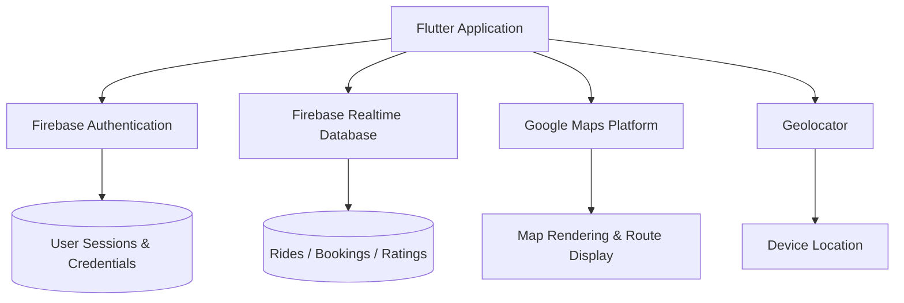
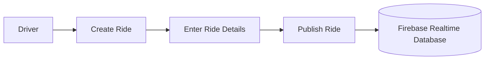
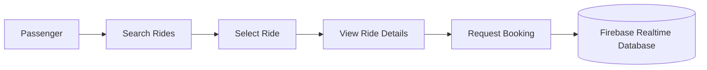

# HopIn

**A Flutter-based carpooling application connecting drivers and passengers travelling along similar routes.**


## Overview

HopIn is a university software engineering project focused on building a mobile carpooling platform. It allows drivers to publish rides along a given route and passengers to discover, filter, and request bookings for those rides. The project also includes an administrative web panel and integrates Firebase for authentication and data storage, alongside Google Maps and device location services for route- and location-aware functionality.

HopIn is developed as an academic/development project and is not intended for production deployment in its current state.

---

## Features

| Category | Description |
|---|---|
| **Authentication** | User registration, login, and profile management via Firebase Authentication |
| **Ride Creation** | Drivers can specify pickup location, destination, date, time, available seats, and fare, then publish the ride |
| **Ride Discovery** | Passengers can browse and search for available rides and view ride details |
| **Booking Requests** | Passengers can request to book a published ride |
| **Fare Calculation** | The app provides an estimated fare for a ride |
| **Maps & Location** | Google Maps and device geolocation are used to represent pickup/destination points |
| **Women-Only Filter** | An optional filter for rides restricted to women passengers/drivers, intended as an additional safety and comfort mechanism |
| **Ride & Booking History** | Users can view their past rides and bookings |
| **Ratings** | Users can rate and review completed rides |
| **Admin Panel** | A web-based administrative panel accompanies the mobile application |

> **Note:** Features listed under [Future Improvements](#future-improvements) are **not** part of the current implementation.

---

## Technology Stack

### Mobile Application
- Flutter
- Dart

### Backend
- Firebase Authentication
- Firebase Realtime Database

### Maps & Location
- Google Maps Flutter
- Google Maps Platform
- Geolocator

### UI / Styling
- Google Fonts
- Flutter Material UI

### Development & Version Control
- Git
- GitHub
- Android Studio
- Visual Studio Code

---

## User Roles

### Driver
- Create and publish rides
- Specify pickup location, destination, date, and departure time
- Specify available seats and fare
- Manage published rides
- Manage passenger booking requests

### Passenger
- Search and browse available rides
- Apply ride-related filters (including the women-only filter)
- View ride details
- Request bookings
- View booking status and history

A single user account can act as either a driver or a passenger depending on the journey.

---

## System Architecture

HopIn is a Flutter client application backed by Firebase services, with Google Maps and Geolocator providing location functionality.



---

## Application Workflows

### User Authentication


### Driver Ride Creation



### Passenger Booking



---

## Database Overview

HopIn uses **Firebase Realtime Database**. The structure below is a **simplified conceptual representation** of the logical entities involved, not an exact schema.

```text
users
  └── userId
        ├── name
        ├── email
        └── role (driver / passenger)

rides
  └── rideId
        ├── driverId
        ├── pickupLocation
        ├── destination
        ├── date
        ├── time
        ├── availableSeats
        └── fare

bookings
  └── bookingId
        ├── rideId
        └── passengerId

ratings
  └── ratingId
        ├── rideId
        └── userId
```

---

## Project Structure

```text
hopin/
├── android/
├── ios/
├── web/
├── lib/
│   ├── main.dart
│   ├── models/
│   ├── screens/
│   ├── services/
│   ├── widgets/
│   ├── utils/
│   └── ...
├── integration_test/
│   └── login_test.dart
├── test/
├── assets/
├── pubspec.yaml
├── firebase_options.dart
├── .gitignore
└── README.md
```

---

## Getting Started

### Prerequisites

- Flutter SDK
- Dart SDK
- Android Studio or Visual Studio Code
- Git
- A Firebase project
- Google Maps API access

Verify your Flutter installation:

```bash
flutter doctor
```

### Clone and Install

```bash
git clone <repository-url>
cd hopin
flutter pub get
```

> Replace `<repository-url>` with the actual repository URL.

---

## Firebase Configuration

HopIn requires a Firebase project with the following services enabled:

- Firebase Authentication
- Firebase Realtime Database

Configure Firebase for your platforms using FlutterFire:

```bash
flutterfire configure
```

Ensure platform-specific configuration files (e.g. `google-services.json`, `GoogleService-Info.plist`, and `firebase_options.dart`) are generated and placed correctly for your target platforms.

> **Security Warning:** Never commit private keys, service account credentials, passwords, secrets, or production credentials to the repository.

---

## Google Maps Configuration

HopIn uses Google Maps and device location services. To run the application:

1. Enable the relevant Google Maps services for your project in Google Cloud Console (the specific set of APIs required depends on the target platform).
2. Generate a Google Maps API key.
3. Restrict the API key appropriately (e.g. by platform and API) and avoid exposing it unnecessarily in version control.

---

## Running the Application

List available devices:

```bash
flutter devices
```

Run on the default connected device:

```bash
flutter run
```

Run on a specific device:

```bash
flutter run -d <device-id>
```

---

## Testing

The project includes an integration test:

```text
integration_test/login_test.dart
```

Run unit/widget tests:

```bash
flutter test
```

Run integration tests:

```bash
flutter test integration_test/
```

---

## Admin Panel

HopIn includes an administrative web panel alongside the mobile application. It is intended to support the operational and management side of the platform.

---

## Security

HopIn incorporates the following security-relevant practices:

- Firebase Authentication for identity and session management
- Access control on Firebase Realtime Database operations
- Requiring authentication for sensitive operations
- Restriction of Google Maps API keys
- Input validation on user-provided data
- Avoidance of hard-coded credentials in source code
- Handling of user-specific data on a per-account basis

HopIn is an academic/development project and has **not** undergone formal security testing or a production security review. Any deployment beyond an academic context would require additional security testing, hardening, and review.

---

## Safety Features

HopIn includes the following safety-oriented mechanisms:

- **Women-only ride filtering** — an optional filter intended to provide additional safety and comfort for users
- **User authentication** — all users must authenticate via Firebase before using core functionality
- **Ratings and reviews** — allow users to rate rides and build a history of feedback

These mechanisms are designed to support user trust and comfort, but they **do not guarantee** user safety and should not be relied upon as a complete safety solution.

---

## Screenshots

Screenshots can be added to the following location:

```text
docs/
└── screenshots/
    ├── login.png
    ├── dashboard.png
    ├── create-ride.png
    ├── ride-search.png
    ├── ride-details.png
    └── profile.png
```

| Login | Dashboard | Create Ride |
|---|---|---|
|  |  |  |

| Ride Search | Ride Details | Profile |
|---|---|---|
|  |  |  |

> Screenshot files are not yet included in this repository and should be added to `docs/screenshots/` as the corresponding image files.

---

## Limitations

- Limited scalability testing has been performed
- Dependence on third-party mapping and location services
- Further security testing is required before any production use
- Real-time ride tracking is limited in the current implementation
- Payment functionality is limited/not implemented
- Additional performance optimisation may be required as usage grows

---

## Future Improvements

The following are **not implemented** and represent potential directions for future work:

- Real-time driver location tracking
- Push notifications
- Online payment integration
- Advanced route-based ride matching
- Improved fare calculation
- Enhanced rating/reputation system
- Emergency/SOS functionality
- Route optimisation
- Administrative analytics
- Scalability and performance improvements

---

## Roadmap

### Implemented

- [x] User authentication
- [x] User profiles
- [x] Ride creation
- [x] Ride discovery
- [x] Ride booking
- [x] Fare calculation
- [x] Google Maps integration
- [x] Location services
- [x] Women-only ride filtering
- [x] Ride history
- [x] Admin panel

### Planned

- [ ] Real-time ride tracking
- [ ] Push notifications
- [ ] Payment integration
- [ ] Advanced ride matching
- [ ] SOS/emergency functionality
- [ ] Advanced analytics

---

## Contributing

1. Fork the repository
2. Create a feature branch
3. Make your changes
4. Test your changes
5. Commit your changes
6. Push the branch
7. Open a Pull Request

```bash
git checkout -b feature/new-feature
git commit -m "Add new feature"
git push origin feature/new-feature
```

---

## Development Guidelines

- Follow standard Flutter/Dart conventions
- Keep code modular and organised by responsibility (`models/`, `screens/`, `services/`, `widgets/`, `utils/`)
- Never commit secrets, API keys, or credentials
- Test changes before submitting a pull request
- Use clear, meaningful commit messages
- Ensure database operations are properly authenticated
- Document significant changes

---

## Project Objectives

1. Develop a functional mobile carpooling platform.
2. Connect drivers and passengers travelling along similar routes.
3. Provide an accessible ride discovery and booking system.
4. Help reduce individual transportation costs.
5. Improve vehicle occupancy.
6. Provide location-aware functionality.
7. Introduce safety-focused ride filtering.
8. Provide centralised ride and booking management.
9. Demonstrate integration of mobile application development with cloud-based services.

---

## Acknowledgements

This project makes use of the following technologies:

- [Flutter](https://flutter.dev/)
- [Dart](https://dart.dev/)
- [Firebase](https://firebase.google.com/)
- [Google Maps Platform](https://mapsplatform.google.com/)
- [Geolocator](https://pub.dev/packages/geolocator)
- [Google Fonts](https://fonts.google.com/)

---

## License

This project is currently intended for **academic and educational purposes** as part of a university software engineering project. No license has been formally applied to this repository.

If the project is distributed publicly in the future, an appropriate `LICENSE` file should be added to the repository root.
